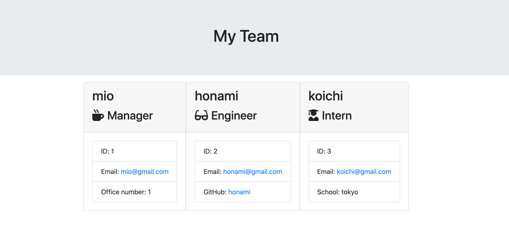

Folder update content:
Update date：July 27, 2020

URL:https://miosagawa.github.io/05_Template-Engine/Develop/output/team.html
Github:https://github.com/miosagawa/05_Template-Engine.git
video:https://drive.google.com/file/d/1tjudvVGRCmSiNaJ2GRmPTSyWjUccJdaD/view

1.Template Engine（Created according to the following conditions）

You will build a software engineering team generator command line application. The application will prompt the user for information about the team manager and then information about the team members. The user can input any number of team members, and they may be a mix of engineers and interns. This assignment must also pass all unit tests. When the user has completed building the team, the application will create an HTML file that displays a nicely formatted team roster based on the information provided by the user. 
※As a manager
I want to generate a webpage that displays my team's basic info
so that I have quick access to emails and GitHub profiles

    __Project sample:__

